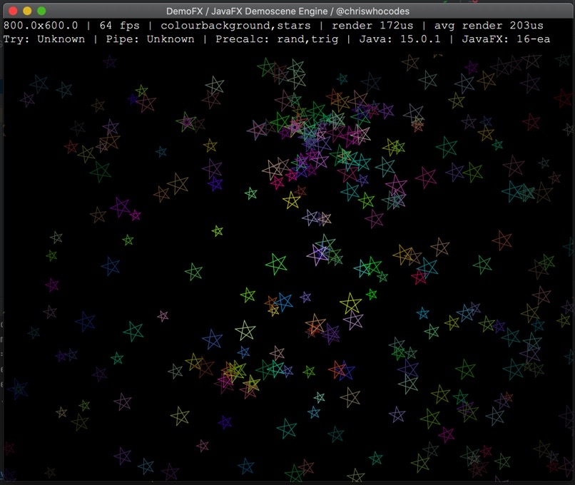
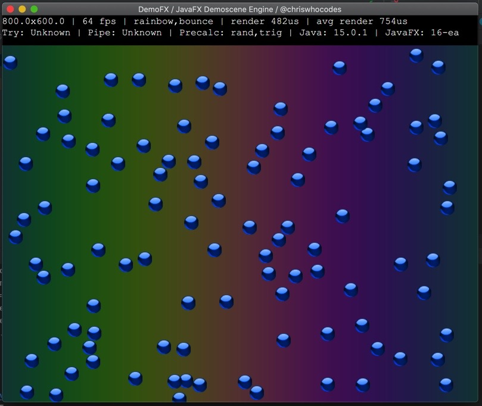

# DemoFX

Performance test platform for JavaFX.
Effects can be layered and scheduled on a timeline.

Videos of the demo effects:

* Part I : https://www.youtube.com/watch?v=N1rihYA8c2M
* Part II: https://www.youtube.com/watch?v=WZf0j4GUFYM
* Part III: https://www.youtube.com/watch?v=9jztG_l8qrk
* Christmas Demo 2017: https://youtu.be/npxfaHAAjBQ
* More Moiré: https://www.youtube.com/watch?v=B48aeSd379w

Used to discover the best techniques for optimising JavaFX performance on the Raspberry Pi and Desktop.

## Compile

### Gradle

```
./gradlew jar
```

### Maven

```
mvn clean package
```

## Run 

Get the latest OpenFX from [the Gluon website](https://gluonhq.com/products/javafx/), 
e.g. in `/opt/javafx-sdk-16`.





```
bash run_on_mac.sh [options]

-e <effects>               comma separated list of effects (See SimpleEffectFactory)
-t <seconds>               run for t seconds
-c <count>                 number of items on screen
-f <true>                  fullscreen mode (no stats pane)
-w <width>                 canvas width
-h <height>                canvas height
-l [sqrt,trig,rand,none]   use lookup tables for Math.sqrt, Math.{sin|cos}, Math.Random
-m <line|poly|fill>        canvas plot mode
-a <audio filename>        Play audio file
-s <true>                  use ScriptedDemoConfig

Current list of effects:
blur, bobs, bounce, burst, checkerboard, chord, chromakey, cogs, colourbackground,
concentric, credits, creditssprite, cubefield, cyclebackground, diamonds, doomfire, equaliser,
equalisercubes, falling, feedback, fireworks, flash, fractalrings, glowboard, grid, hexagons,
honeycomb, hue, imagebackground, inversechromakey, mandala, mandelbrot, mask,
maskstack, mirrorx, mirrory, moire, moremoire, pentagons, picinpic, quadplay, rain, rainbow,
rawplayer, raytrace, rings, rotations, sea, sheet, shift, sierpinski, sinelines, snowfieldsprite, spin,
sprite3d, spritewave, squares, starfield, starfieldsprite, stars, texcube,
texsphere, textbounce, textlabel, textlayers, textring, textwave, textwavesprite,
tiles, triangles, tubestack, tunnel, twister, typetext, vumeter, wordsearch
```

Examples:

```
# Default settings
./run.sh

# Triangle effect, 500 shapes run for 10 seconds
./run.sh -e colourbackground,triangles -c 500 -t 10

# Square effect, set 640x480 canvas size
./run.sh -e colourbackground,squares -w 640 -h 480

# Star effect, plot mode line
./run.sh -e colourbackground,stars -m line

# Bounce effect with rainbow background
./run.sh -e rainbow,bounce

# Burst effect with rainbow background
./run.sh -e rainbow,burst

# Layered effects: grid,ballwave
./run.sh -e grid,ballwave

# DemoFX Part III scripted demo:
./run.sh -s true -f true -w 1280 -h 720

# Christmas DemoFX scripted demo:
./run.sh -s xmas -f true -w 1280 -h 720

#More Moiré scripted demo
./run.sh -s moire -f true -w 1280 -h 720
```

In order to run in another java version, like java 9. JAVA_HOME should be set.
In MAC:

```
export JAVA_HOME=/Library/Java/JavaVirtualMachines/jdk-9.jdk/Contents/Home
./run.sh
```

If the frame rate is not vsynced on Ubuntu then run:

```
export _JAVA_OPTIONS="-Dquantum.multithreaded=false"
```
